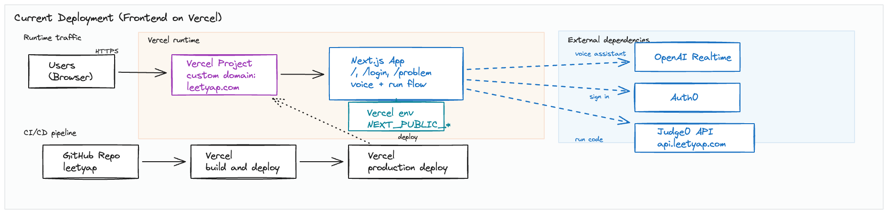

# LeetYap

Product name: `leetyap` (LeetYap).
Repository name: `leetyap`.
GitHub repository: [matoanbach/leetyap](https://github.com/matoanbach/leetyap)
Production site: https://leetyap.com

`leetyap` is a coding interview practice platform for LeetCode-style problems. Users can practice problems in an in-browser editor, run their solutions, and get guided help from an AI voice interviewer.

Built as a solo project.

## Who It’s For

People:
- Candidates preparing for technical interviews.
- Students practicing data structures and algorithms.
- Engineers doing timed practice sessions.

## What It Does

This app includes:
- A landing page and sign-in flow.
- A problem-solving workspace with a problem description pane, a Python code editor, and an output pane that shows the result of running code.
- A timer and a few workspace settings (font sizes, text color).
- An AI voice interviewer that can guide the user through a structured interview-style solving flow.

Notes:
- The problem set is currently a small demo set.
- The AI voice interviewer currently uses a user-provided API key in the browser.

## Why It’s Interesting

- It simulates a real interview loop: problem understanding, approach discussion, implementation, testing, and complexity review.
- The assistant can interact with the live editors (read, suggest edits, and highlight lines), which makes the guidance feel hands-on.

## Technical Details

This section describes what the repository actually contains today and how the main features are implemented.

Everything below is written for engineers.

## Tech Stack

- Next.js 15 (Pages Router), React 18
- Tailwind CSS + Sass
- Redux Toolkit
- CodeMirror (`@uiw/react-codemirror`)
- Auth0 (`@auth0/auth0-react`, `@auth0/auth0-spa-js`)
- Judge0 (remote code execution)
- OpenAI (`openai`, `@openai/realtime-api-beta`)

## Project Layout

- Landing page: `src/pages/index.tsx`
- Problem workspace: `src/pages/problem/index.tsx`
- Login page: `src/pages/login/index.tsx`
- Top bar (Run, Sign In, navigation): `src/components/Topbar/Topbar.tsx`
- Workspace UI: `src/components/AnotherWorkspace/**`
- Voice assistant: `src/components/Buttons/Voice/**`
- State (Redux): `src/state/**`
- Problem set: `src/utils/problems/**`
- Interviewer prompt/instructions: `src/utils/prompts/instructions.ts`

## Run Locally

Requirements:
- Node.js (this repo uses Next.js `15.x`).

Commands:
```bash
npm install
npm run dev
```

Then open `http://localhost:3000`.

Other useful scripts:
```bash
npm run lint
npm run build
npm run start
```

## Environment Variables

This repo ignores `.env*` files via `.gitignore`. Put local configuration in `.env.local`.

Auth0:
- `NEXT_PUBLIC_AUTH0_DOMAIN`
- `NEXT_PUBLIC_AUTH0_CLIENT_ID`
- `NEXT_PUBLIC_AUTH0_REDIRECT_URL`

Judge0 (code runner API + auth headers):
- `NEXT_PUBLIC_JUDGE0_URL` (example: `https://api.leetyap.com`)
- `NEXT_PUBLIC_AUTHN_HEADER` (defaults to `X-Auth-Token`)
- `NEXT_PUBLIC_AUTHN_TOKEN`
- `NEXT_PUBLIC_AUTHZ_HEADER` (defaults to `X-Auth-User`)
- `NEXT_PUBLIC_AUTHZ_TOKEN`

OpenAI:
- The voice interviewer prompts for an API key in the UI and uses it in the browser.

Security note: any `NEXT_PUBLIC_*` value is shipped to the browser. Don’t treat these as secrets.

## Cloud Architecture

### Current 

This repository is frontend-only:
- Next.js web app deployed on Vercel and served at `https://leetyap.com`.
- Client-side calls to Auth0 (authentication), Judge0 (code execution at `api.leetyap.com`), and OpenAI Realtime (voice interviewer; currently uses a user-provided key).
- Production deploys are connected directly from GitHub to Vercel.

Architecture diagram:

This view separates the runtime request flow from the GitHub-to-Vercel deployment path so it is easy to see which calls happen in the browser versus which systems are only involved during deployment.



### Future 

For a production system, you would typically add:
- A backend API to handle auth/session management, rate limiting, and audit logs.
- Server-side secrets management for Judge0/OpenAI credentials (no secrets in the client).
- Persistent storage for problems, submissions, history, and user progress.
- A job/execution layer to broker code runs (rather than direct client-to-Judge0 calls).
- Observability (structured logs, metrics, traces) and abuse protection.

## What To Improve

Product:
- Add a problem picker and per-problem routes instead of always defaulting to `two-sum`.
- Add a submissions history and saved progress.
- Add language support beyond Python.

Security:
- Move Judge0/OpenAI integration server-side and avoid exposing long-lived tokens in `NEXT_PUBLIC_*`.
- Avoid using raw OpenAI API keys in the browser (even if user-provided) for production usage.
- Add input validation and rate limiting around code execution and assistant actions.

Engineering quality:
- Add automated tests (unit + integration/e2e).
- Add typecheck and lint in CI.
- Fix minor state bugs (example: editor insert actions should update the correct editor slice).

## Judge0 Self-Hosting (Optional)

If you don’t want to rely on a hosted Judge0 endpoint, you can deploy Judge0 yourself and point `NEXT_PUBLIC_JUDGE0_URL` at it.

1. Download and extract the release archive
```bash
wget https://github.com/judge0/judge0/releases/download/v1.13.1/judge0-v1.13.1.zip
unzip judge0-v1.13.1.zip
```

2. Update values in `judge0.conf` (auth headers/tokens, Redis, Postgres).

3. Run services
```bash
cd judge0-v1.13.1
docker-compose up -d db redis
sleep 10s
docker-compose up -d
```
